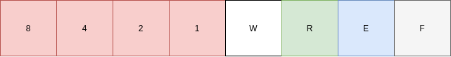

# MeMager

## Overview

MeMager is a simple memory manager with a block memory structure (but I'm not sure 🤔). You can

* initialise memory
* allocate pointer from this memory structure
* free pointer
* write data
* read data
* move pointer (it's a trap)

## Architecture

The memory manager makes a request to the operating system memory during initialization with a system call. Then split (actually
no) memory by blocks. Each block has the same structure: header-byte and raw memory. The header describe information of
this block (see section [Memory block](#Memory-block)). But sometimes header is useless. So, block has the header only
if pointer to this block created.

## How it works

### Init

When you try to init memory, you must pass blocks count and the size of one block in bytes. Manager will call the malloc
function to get blocks_count*block_size bytes. Each initialising will free memory from the last init.  
So, if you pass (0,0), all system memory occupied by the manager will be freed.

### Alloc

To alloc memory from manager, you can call alloc_ptr function and pass num of bytes. If you pass num of bytes less than
block size, will be allocated one block. But if you need to allocate more bytes than block size, will be allocated a
number of bytes that is a multiple of the block size (n*block_size). In case where passed num of bytes is equal to the
block_size, two blocks will be allocated, because one byte is reserved for the header.

### Free

To free allocated memory you should call free_ptr function. Simple memory freeing but with a gag. If you try to free
last occupied block, and one or more blocks before him are freed, pointer on last block will be placed after last
occupied block. But the user will not notice it. The usual defragmentation.

### Write and read

This manager uses byte-by-byte copying. In the case of writing - copying from buffer to memory. In the case of reading -
copying from memory to the buffer.

## Memory block

The most complex and interesting part)
Each memory block as a structure has fixed size, but in some cases multiple blocks "glued" together. For example, if you
try to allocate more memory than block_size, result "block" will have single header for group of block-structs.

### Example

* Init memory (64, 10)
* Alloc 5 bytes
* Alloc 80 bytes
* Alloc 20 bytes

Memory:
[H, 5/63] [H, 63/63] [17/64] [H, 20/63]

You can see in which blocks the header is and how many bytes the information occupies in fact.

### Header structure

Description (from the lowest byte - from the right)

1. F - free bit. This bit is used for mark free blocks (can be overwritten)
2. E - extended bit. This bit is used for marking extended blocks. Block marked by this bit if user try to allocate more
   bytes than block_size. In the [Example](#example) is the second block (glued).
3. R - read bit. Not implemented.
4. W - write bit. Not implemented.  
5. 1-st bit of the number of extended blocks. Max you can have extended block from 16 blocks.
6. 2-nd bit.
7. 3-d bit.
8. 4-th bit.

